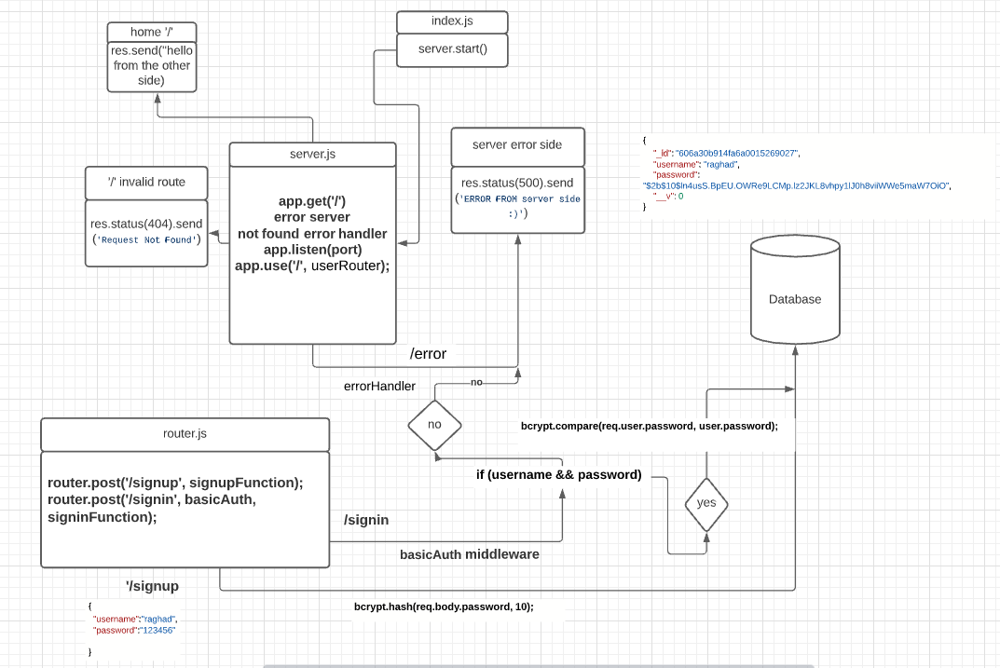

# basic-auth

Authentication System: an Express server that implements Basic Authentication, with signup and signin capabilities, using a Mongo database for storage.

[deployed link](https://basic-auth-raghad.herokuapp.com/)

## Setup
 
Install

* Clone the repository from GitHub
* npm init -y
* install dependencies npm i express dotenv cors base-64 bcrypt mongoose jest @codefellows/supergoose 

Test
Run the command npm test to test and verify the server and the middle wares are working.
Run the command npm run lint for testing lint.

Run
Start the server using nodemon , npm start
npm test for testing 

# UML diagram 

